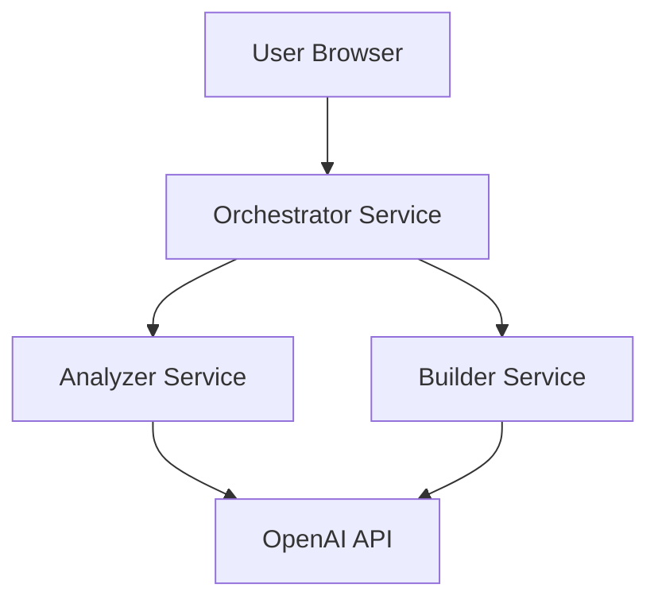

# AI Web Upgrader - Orchestrator Service

A Next.js frontend application that orchestrates the AI Web Upgrader POC system, providing a user-friendly interface for website analysis and homepage generation.

## Overview

The Orchestrator Service serves as the frontend web interface and API gateway for the AI Web Upgrader POC. It coordinates communication between the analyzer and builder services while providing an intuitive user experience for website analysis and improvement recommendations.

## Features

- 🌐 **Modern Web Interface**: React-based UI with Tailwind CSS styling
- 🔄 **Service Orchestration**: Coordinates analyzer and builder services
- 📊 **Progress Tracking**: Real-time analysis progress with step-by-step updates
- 📱 **Responsive Design**: Mobile-first, fully responsive interface
- 🎨 **Professional UI/UX**: Clean, modern design with smooth animations
- 🔧 **API Gateway**: Proxies and orchestrates backend service calls
- 📈 **Business Intelligence**: Displays analysis results and recommendations
- 🚀 **Performance Optimized**: Next.js with optimized builds and caching

## Quick Start

### Prerequisites

- Node.js 18+
- npm 9+
- Running analyzer and builder services (for full functionality)

### Environment Setup

Create a `.env.local` file:

```bash
NODE_ENV=development
PORT=3000
NEXT_PUBLIC_API_URL=http://localhost:3000
ANALYZER_SERVICE_URL=http://localhost:8001
BUILDER_SERVICE_URL=http://localhost:8002
```

### Development

```bash
# Install dependencies
npm install

# Start development server
npm run dev

# Open browser
open http://localhost:3000
```

### Production Build

```bash
# Build for production
npm run build

# Start production server
npm start
```

### Docker Deployment

```bash
# Quick deployment
./scripts/deploy.sh

# Manual Docker commands
docker-compose up -d

# Check status
curl http://localhost:3000/api/health
```

## API Endpoints

### Health Check
```http
GET /api/health
```

Returns service status and dependency health.

### Website Analysis
```http
POST /api/analyze
Content-Type: application/json

{
  "url": "https://example.com"
}
```

Orchestrates website analysis through the analyzer service.

### Homepage Generation
```http
POST /api/generate
Content-Type: application/json

{
  "analysis_result": {...},
  "business_name": "Example Business",
  "style_preference": "modern"
}
```

Generates homepage through the builder service.

## Configuration

### Environment Variables

| Variable | Default | Description |
|----------|---------|-------------|
| `NODE_ENV` | `production` | Environment mode |
| `PORT` | `3000` | Service port |
| `NEXT_PUBLIC_API_URL` | `http://localhost:3000` | Public API URL |
| `ANALYZER_SERVICE_URL` | `http://analyzer:8001` | Analyzer service URL |
| `BUILDER_SERVICE_URL` | `http://builder:8002` | Builder service URL |

### Service URLs

The orchestrator proxies requests to backend services:
- **Analyzer**: All `/api/analyze/*` routes → `${ANALYZER_SERVICE_URL}/analyze/*`
- **Builder**: All `/api/generate/*` routes → `${BUILDER_SERVICE_URL}/generate/*`

## User Interface

### Main Features

#### Homepage
- Hero section with clear value proposition
- Website analysis form with URL validation
- Feature highlights and benefits
- Demo examples for quick testing

#### Analysis Results
- Business information extracted from website
- Identified issues with severity indicators
- Prioritized recommendations with cost estimates
- SEO analysis and opportunities
- Progress tracking during analysis

#### Components
- **AnalysisForm**: URL input with validation and submission
- **AnalysisResults**: Comprehensive results display
- **LoadingSpinner**: Progress tracking with status updates
- **SalesCTA**: Business lead capture components

### Design System

- **Colors**: Blue/purple gradient theme
- **Typography**: Responsive text with clear hierarchy
- **Layout**: Card-based design with hover effects
- **Icons**: Lucide React icon library
- **Animations**: Smooth transitions and loading states

## Development

### Project Structure

```
orchestrator-service/
├── src/
│   ├── components/          # React components
│   │   ├── AnalysisForm.tsx
│   │   ├── AnalysisResults.tsx
│   │   ├── LoadingSpinner.tsx
│   │   └── SalesCTA.tsx
│   ├── pages/              # Next.js pages and API routes
│   │   ├── api/
│   │   │   ├── analyze.ts  # Analysis orchestration
│   │   │   └── health.ts   # Health check
│   │   ├── _app.tsx        # App wrapper
│   │   └── index.tsx       # Main page
│   └── styles/
│       └── globals.css     # Global styles
├── scripts/                # Deployment scripts
├── tests/                  # Test files
├── Dockerfile             # Docker configuration
├── docker-compose.yml     # Container orchestration
├── next.config.js         # Next.js configuration
├── tailwind.config.js     # Tailwind CSS config
├── tsconfig.json          # TypeScript config
└── package.json           # Dependencies
```

### Adding New Features

1. **New Component**:
```tsx
// src/components/NewComponent.tsx
import React from 'react';

interface NewComponentProps {
  data: any;
}

export default function NewComponent({ data }: NewComponentProps) {
  return (
    <div className="bg-white rounded-lg shadow-md p-6">
      {/* Component content */}
    </div>
  );
}
```

2. **New API Route**:
```typescript
// src/pages/api/new-endpoint.ts
import type { NextApiRequest, NextApiResponse } from 'next';

export default async function handler(
  req: NextApiRequest,
  res: NextApiResponse
) {
  if (req.method === 'POST') {
    // Handle POST request
    res.status(200).json({ success: true });
  } else {
    res.status(405).json({ error: 'Method not allowed' });
  }
}
```

3. **New Page**:
```tsx
// src/pages/new-page.tsx
import Head from 'next/head';

export default function NewPage() {
  return (
    <>
      <Head>
        <title>New Page - AI Web Upgrader</title>
      </Head>
      <div className="min-h-screen bg-gray-50">
        {/* Page content */}
      </div>
    </>
  );
}
```

## Testing

```bash
# Run type checking
npm run type-check

# Run linting
npm run lint

# Integration tests
./scripts/test.sh

# Manual testing
curl http://localhost:3000/api/health
open http://localhost:3000
```

### Test Coverage

The test script covers:
- Health check functionality
- Home page loading
- API endpoint availability
- Performance testing
- Error handling

## Deployment

### Development Deployment

```bash
npm run dev
```

### Production Deployment

```bash
# Build and start
npm run build && npm start

# Or with Docker
./scripts/deploy.sh
```

### Docker Configuration

The Dockerfile uses multi-stage builds:
1. **Dependencies**: Install npm packages
2. **Builder**: Build Next.js application
3. **Runner**: Production runtime with minimal footprint

### Platform Support

- **Vercel**: Native Next.js deployment
- **Netlify**: Static export or serverless functions
- **Docker**: Self-hosted container deployment
- **Coolify**: Simplified container deployment

## Performance

### Optimization Features

- Next.js automatic code splitting
- Image optimization and lazy loading
- CSS purging with Tailwind
- API route caching
- Standalone output for Docker

### Monitoring

- Health checks for container orchestration
- Performance tracking for page loads
- Error boundaries for graceful failure handling
- Real-time progress updates for user feedback

## Security

- Environment variable configuration
- CORS headers for API security
- Input validation and sanitization
- Non-root container execution
- Secure service-to-service communication

## Troubleshooting

### Common Issues

**Service connection errors:**
- Verify analyzer/builder service URLs
- Check Docker network connectivity
- Confirm services are running and healthy

**Build failures:**
- Check Node.js version compatibility
- Verify all dependencies are installed
- Review TypeScript compilation errors

**Port conflicts:**
- Change PORT environment variable
- Check for other services using port 3000
- Update Docker port mappings

### Debugging

```bash
# Check service logs
docker-compose logs -f orchestrator

# Test API endpoints
curl http://localhost:3000/api/health

# Verify service connectivity
curl http://localhost:8001/health  # Analyzer
curl http://localhost:8002/health  # Builder
```

## Integration

### Service Architecture



### Data Flow

1. User submits website URL
2. Frontend validates and submits to `/api/analyze`
3. API route calls analyzer service
4. Analysis results processed and displayed
5. Optional homepage generation via builder service
6. Results presented with recommendations

## Contributing

1. Follow existing code patterns and structure
2. Add TypeScript types for all new interfaces
3. Include responsive design considerations
4. Test on multiple screen sizes
5. Update documentation for new features

## License

MIT License - see LICENSE file for details.